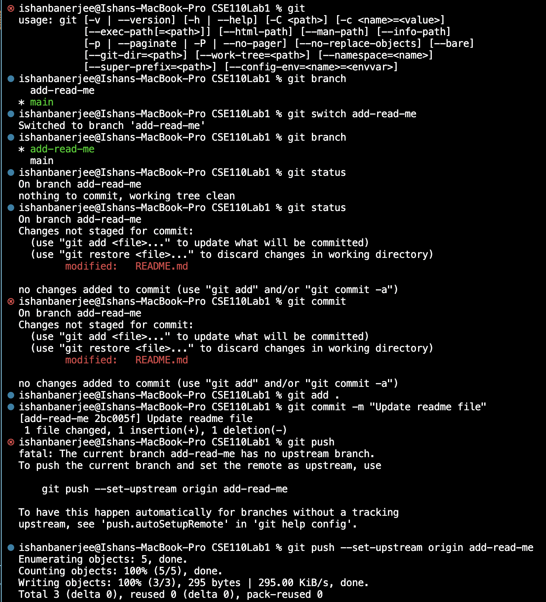
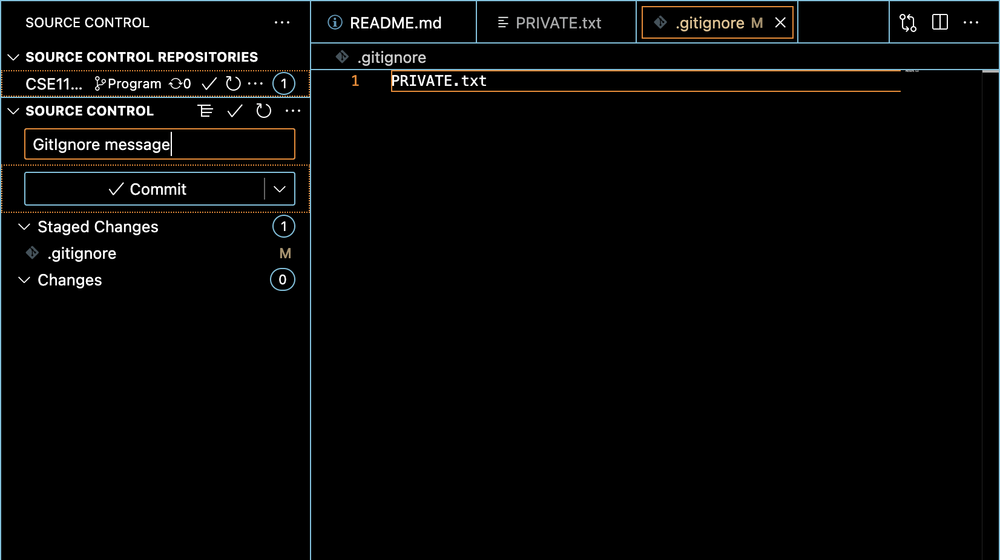

# Ishan Banerjee's User Page

**This is where I create my User Page, which will include content that introduces who I am as as a programmer and as a person**

>  My user page has been made with markdown, as given in the instructions

## Part 1. Installing Visual Studio Code and Extensions

- I installed VSCode with the instructions mentioned and the extensions which come with it. 

* I used the following [Link](https://code.visualstudio.com/download), to download the required files. 

+ Having done that, I proceeded onto the next part of our task.

## Part 2. (Re)Familiarizing Ourselves with Git

I created the GitHub repository for my GitHub Pages project. I made sure that the repository is public and includes a "README.md" file. 

I followed all the instructions mentioned, and started by cloning the repository given using `github clone`. Then I `cd'ed` into the repo folder and created a new branch and named that as `add-read-me`.

After that I used `github checkout` to checkout of the given repository and go back to the root. 

I added the relevant information to the READ_ME file and then added this new file using `git add`.

I committed the file using `git commit` and then pushed the file using the `set-upstream` flag. 

Here is a screenshot of these commands as deliverable:

## VSCode UI

1. I created a file titled PRIVATE.txt. In this file, I placed my name and PID.

2. Once this was done, I created a `.gitignore` file in the root of my repository and added the path to a file named 
`PRIVATE.txt`

3. Once this was done, Under the `Source Control` tab, I staged the changes and added an appropriate commit message.

4. Here is a screenshot of the staged commit, with an appropriate commit message:

You can also access the README.md file through this the following link [Programming language](README.md) 

I followed the following checklist:

- [x] Part 1. Installing Visual Studio Code and Extensions
- [x] Part 2. (Re)Familiarizing Ourselves with Git
- [x] VSCode UI
- [x] Part 3. Using Markdown

